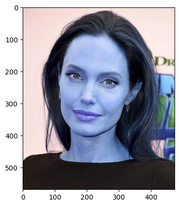
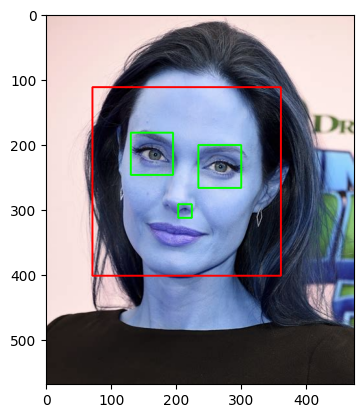
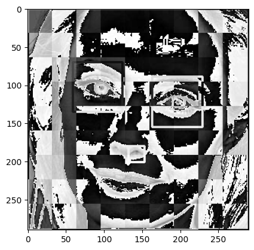

# Famous Personality Image Classification

A **computer vision and machine learning project** that classifies images of 17 famous personalities using face detection, Wavelet-based feature engineering, and supervised machine learning.

The project implements an end-to-end image classification workflow — from detecting and preprocessing faces to feature extraction, model comparison, hyperparameter tuning, evaluation, and model serialization.

---

## Project Overview

The objective of this project is to build a multi-class image classifier capable of identifying a famous personality from a facial image.

The dataset contains images belonging to **17 different personalities**. Images are first processed using **OpenCV** to detect faces and eyes. Valid facial regions are then cropped and transformed into a combination of raw image features and **Wavelet features**.

Multiple machine learning algorithms were evaluated, with a tuned **Support Vector Machine (SVM)** providing the best performance.

---

## Image Processing Pipeline

The preprocessing pipeline converts raw images into model-ready facial features.

<table>
  <tr>
    <td align="center"><b>Original Image</b></td>
    <td align="center"><b>Face & Eye Detection</b></td>
    <td align="center"><b>Wavelet Features</b></td>
  </tr>
  <tr>
    <td align="center">
      
    </td>
    <td align="center">
      
    </td>
    <td align="center">
      
    </td>
  </tr>
</table>

### 1. Face Detection & Image Preprocessing

Images are processed using **OpenCV Haar Cascade classifiers**.

The preprocessing workflow:

- Detects faces within each image
- Detects eyes within the identified facial region
- Retains images where facial features can be reliably detected
- Crops the detected facial region
- Resizes images to create consistent model inputs

Using eye detection as an additional validation step helps remove images where the face is partially visible or unsuitable for training.

### 2. Wavelet Feature Extraction

In addition to the original image information, **Wavelet Transform** is applied using PyWavelets.

Wavelet transformation captures high-frequency information such as:

- Facial edges
- Structural patterns
- Texture information
- Changes in pixel intensity

The Wavelet representation is combined with the resized raw image features to create the final feature vector used for model training.

---

## Machine Learning Workflow

The overall pipeline follows:

```text
Raw Images
    ↓
Face Detection
    ↓
Eye Detection
    ↓
Face Cropping
    ↓
Image Resizing
    ↓
Wavelet Transform
    ↓
Feature Combination
    ↓
Train/Test Split
    ↓
Feature Scaling
    ↓
Model Training
    ↓
Hyperparameter Tuning
    ↓
Model Evaluation
```

---

## Model Training & Selection

Three supervised machine learning algorithms were evaluated:

- **Support Vector Machine (SVM)**
- **Logistic Regression**
- **Random Forest**

Hyperparameter tuning was performed using **GridSearchCV** to compare different model configurations.

The tuned **SVM classifier** achieved the strongest performance among the evaluated models and was selected as the final model.

### Model Performance

| Model | Test Accuracy |
|---|---:|
| Support Vector Machine (Tuned) | **64.5%** |
| Logistic Regression | **59.6%** |
| Random Forest | **31.1%** |

The final SVM model achieved approximately **64.5% test accuracy** across the 17-class image classification problem.

---

## Model Evaluation

The models were evaluated using:

- Accuracy
- Precision
- Recall
- F1-score
- Classification Report
- Confusion Matrix

The confusion matrix was used to analyze classification performance across individual personalities and identify classes that were more difficult for the model to distinguish.

---

## Dataset

The image dataset contains **17 personality classes**.

After face detection, eye validation, cropping, and preprocessing, approximately **1,376 facial images** were used in the machine learning pipeline.

The preprocessing stage helps reduce noisy training samples by retaining images where the required facial features can be detected.

---

## Project Structure

```text
Famous-Personality-Image-Classification/
│
├── assets/
│   ├── original_image.png
│   ├── face_detection.png
│   └── wavelet_features.png
│
├── Celebrity Faces Dataset/
│
├── cropped/
│
├── haarcascades_opencv/
│
├── Code.ipynb
├── saved_model.pkl
├── class_dictionary.json
├── requirements.txt
└── README.md
```

### Main Files

**`Code.ipynb`**  
Contains the complete image preprocessing, feature engineering, model training, hyperparameter tuning, and evaluation workflow.

**`saved_model.pkl`**  
Serialized trained classification model for future inference.

**`class_dictionary.json`**  
Maps numerical class labels to personality names.

**`haarcascades_opencv/`**  
Contains the Haar Cascade XML files used for face and eye detection.

**`cropped/`**  
Contains facial images generated during preprocessing.

**`assets/`**  
Contains visualization images used in this README.

---

## Technologies Used

| Category | Technologies |
|---|---|
| **Programming** | Python |
| **Computer Vision** | OpenCV |
| **Machine Learning** | Scikit-learn |
| **Feature Engineering** | PyWavelets |
| **Data Processing** | NumPy |
| **Model Optimization** | GridSearchCV |
| **Model Evaluation** | Classification Report, Confusion Matrix |
| **Model Serialization** | Joblib |
| **Development Environment** | Jupyter Notebook |

---

## Key Features

- Automated face detection using OpenCV
- Eye detection for image-quality filtering
- Automatic facial image cropping
- Wavelet-based feature extraction
- Raw and transformed feature combination
- Multi-class classification across 17 personalities
- Comparison of multiple machine learning algorithms
- Hyperparameter tuning using GridSearchCV
- Model evaluation using classification metrics
- Model serialization for future inference

---

## Skills Demonstrated

This project demonstrates practical experience with:

- Computer Vision
- Image Processing
- Feature Engineering
- Multi-Class Classification
- Machine Learning Model Development
- Support Vector Machines
- Hyperparameter Optimization
- Model Evaluation
- OpenCV
- Scikit-learn
- ML Pipeline Development

---

## Future Improvements

Several improvements could be explored to extend the project:

- Implement a **CNN-based image classifier**
- Apply **transfer learning** using pretrained architectures such as ResNet or EfficientNet
- Introduce image augmentation to improve model generalization
- Compare classical ML performance against deep learning approaches
- Build an inference interface for uploading and classifying new images
- Deploy the trained model through a lightweight web application

---

## Author

**Taranveer Singh Gill**

Data Engineer | Data Science & Machine Learning
